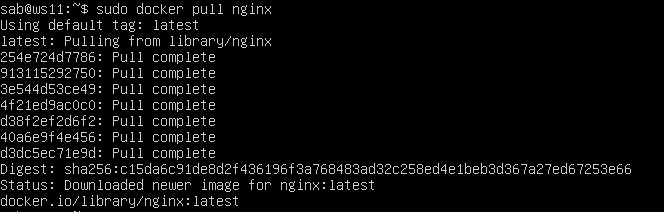

# Simple Docker


## Contents  
1. [Part 1](#part-1-готовый-докер)  
2. [Part 2](#part-2-операции-с-контейнером) 
3. [Part 3](#part-3-мини-веб-сервер)  
4. [Part 4](#part-4-свой-докер)
5. [Part 5](#part-5-dockle)

## Part 1. Готовый докер  
* Первое, что нужно сделать - это установить сам NGINX на наш Ubuntu 20.04. Для этого используем команду ```sudo apt install nginx```  
  
*Красной рамкой выделен процесс загрузки веб-сервера*  

* Командой ```sudo service nginx status``` проверяем, что наш сервер активен. Если он не в активном статусе, то включаем его, для этого используем комаду ```sudo systemctl start nginx```.  
  
*В нашем случае nginx запустился при установке*

* Загрузим наш Docker, используя для этого команду ```sudo snap install docker```  
  
*Snap - этот менеджер позволяет устанавливать контейнеризированные приложения в разных дистрибутивыах Linux*  

* С помощью команды ```sudo docker pull nginx``` подтягиваем последний обновлённый docker-образ с nginx  
  

* Командой ```sudo docker images``` проверяем наличие docker-образа  
   

* Запускаем образ по его repository, при помощи команды ```sudo docker run -d [repository]```   
  
*Опция -d отвечает за то, чтоб запущенный контейнер оставался активным в фоновом режиме*  

* С помощью команды ```sudo docker ps``` смотрим, что докер запущен.  
  

* Далее, введя команду ```sudo docker inspect [docker-name]```, смотрим информацию о контейнере  
   

- Размер контейнера: 192484959 байт.  
  
- Единственный порт , что у нас есть, для этого образа: Открытый порт 80, замапленных портов нет  
  
- IP контейнера: 172.17.0.3   
  

* Через команду ```sudo docker stop [docker-name]```, останавливаем контейнер  
  

* С помощью ```sudo docker ps``` смотрим, что наш докер-контейнер под именем flamboyant_nightingale остановился  
  

* С помощью команды ```sudo docker run -d -p 80:80 -p 443:443 nginx``` запустила докер с портами 80 и 443 в контейнере, замапленными на такие же порты на локальной машине  
  
*Через docker ps смотрим, что контейнер запустился с нужными портами*  

* Проверяем, что в браузере по адресу localhost:80 доступна стартовая страница nginx.  
  

* Перезапускаем докер контейнер через ```docker restart [container_name]``` и смотрим что контейнер запустился  
  
*В STATUS показано, что контейнер запустился именно после рестарта*  

[Вернутьс в содержание](#contents)  

## Part 2. Операции с контейнером  

* Команда docker exec даёт право на использование обычных Linux-команд непосредственно в контейнере.  
* Смотрим включенные контейнеры  
* С помощью комакнды ```sudo docker exec [container-name] cat /etc/nginx/nginx.conf```, смотрим конфигурацию nginx  
  

* На локальном компьютере создаём файл nginx.conf, и вписываем туда отдачу страницы статуса сервера nginx по пути /status  
  

* С помощью команды ```sudo docker cp ~/nginx.conf  [container-name]:/etc/nginx``` копируем файл с локального компьютера на докер-контейнер  
  
*На скрине показано, что копирование прошло успешно*  

* Перезапустим nginx внутри docker-образа, используя команду ```sudo docker exec [container-name] service nginx reload```, но перед этим, проверим, что файл конфигурации nginx мной задан верно командой   

```  
sudo docker exec [container-name] nginx -t  

```  

  
*Красной рамкой виделенна успешная перезагрузка*  

* По адресу localhost:80/status отдается страничка со статусом сервера nginx  
  

* С помощью команды ```sudo docker export [container-name] > container.tar``` экспортировала контейнер в архив container.tar  
  
*Также есть ещё способ, с помощью команды ```sudo docker export [container-name] -o /tmp/zen_jepsen.tar```, различия в том, что в первом случае архивируется контейнер, а во втором непосредственно образ контейнера, также обязательно указать путь /tmp/*  

* Останавливаем контейнер  
  

* Удаляю образ через ``` sudo docker rmi [repository]```, не удаляя перед этим контейнеры, выходит ошибка о невозможности удаления, поэтому использую команду ```sudo docker rmi -f [repository]```. Удаляю остановленный контейнер.  
  

* Импортирую контейнер обратно через команду ``` sudo docker import container.tar new_container```  
  

* Запустили импортированный контейнер командой ```sudo docker run -d -p 80:80 -p 443:443 --name my_cont new_container nginx -g 'daemon off;'```    
  
*Команда в конце ```nginx -g 'daemon off;'``` заставляет работать веб-сервер nginx в соновном потоке, не уходя в daemon, потому чтно если это случится, то контейнер остановится сразу же после запуска*  

* Проверяем отдаётся ли страничка со статусом сервера nginx по адресу localhost:80/status  
 

[Вернутьс в содержание](#contents)  

## Part 3. Мини веб-сервер  

* FastCgi - это CGI-программа, запущенная в цикле. Если обычная CGI-программа заново запускается для каждого нового запроса, то в FastCGI-программе используется очередь запросов, которые обрабатываются последовательно. То есть, если брать связку C, FastCGI и nginx, то получается, что веб-сервер nginx принимает http-запрос и если он соответствует какому-либо параметру, то отправляет его на FastCGI, FastCGI обрабатывает запрос и, например, запускает нужный код, и результат работы возвращает на nginx, а nginx компьютеру.  
* Устанавливаем библиотеку ```sudo apt install libfcgi-dev -y```, чтоб могли пользоваться fcgi_stdio.h  
* Используя команду ```sudo apt install spawn-fcgi``` устанавливаем spawn-fcgi/ Это протокол для взаимодействия веб-серверов (Nginx, Apache) с внешними приложениями (Python, PHP, Perl и др.).  
* Компилируем Си файл в fcgi ```gcc my_server.c -o my_server -lfcgi```  
* Включаем nginx ```sudo nginx -c <Путь до конфигурации nginx>```  
* Далее запускаем наш мини-веб-сервер  ```spawn-fcgi -p 8080 -f ./my_server```  
  

*```sudo lsof -i :8080``` если нам говорят, что невозможно подлючится*  
*```kill -9 <PID>```*  

* Командой ```mkdir -p ./nginx``` создаем папку ./nginx и кладём туда нашу конфигурацию. Получается ./nginx/nginx.conf и нах nginx видит нужный путь до конфига.  

[Вернутьс в содержание](#contents)  


## Part 4. Свой докер  

* Создаём свой Dockerfile и вписываем туда нужные команды  


* В файл power.sh прописываем команды сбора образа ```docker build . -t app:test``` и его запуска с 81 на 80 порт командой ```docker run -d -p 80:81 app:test```


* По localhost:80 страничка отдаётся  
  

* localhost:80/status отдаётся stub-статус  
  

[Вернутьс в содержание](#contents)  

## Part 5. Dockle  


[Вернутьс в содержание](#contents)  